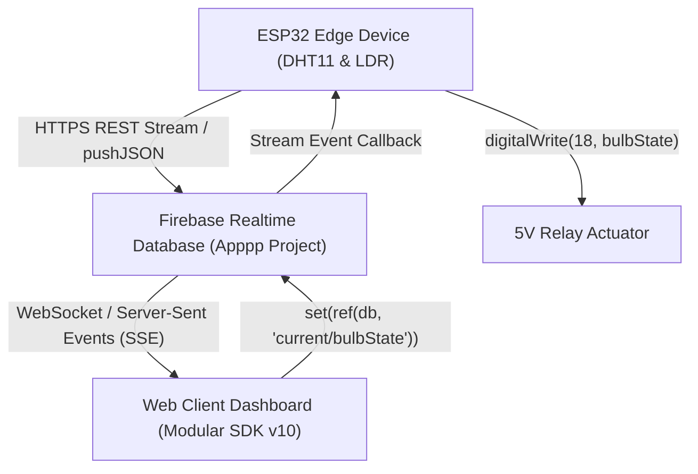

# Architecture: Firebase Realtime Database Telemetry & Sync

```mermaid
flowchart TD
    ESP32["ESP32 Edge Device (DHT11 & LDR)"]
    RTDB["Firebase Realtime Database (Apppp Project)"]
    WebClient["Web Client Dashboard (Modular SDK v10)"]

    ESP32 -->|"HTTPS REST Stream / pushJSON"| RTDB
    RTDB -->|"WebSocket / Server-Sent Events (SSE)"| WebClient
    WebClient -->|"set(ref(db, 'current/bulbState'))"| RTDB
    RTDB -->|"Stream Event Callback"| ESP32
    ESP32 -->|"digitalWrite(18, bulbState)"| Relay["5V Relay Actuator"]
```
